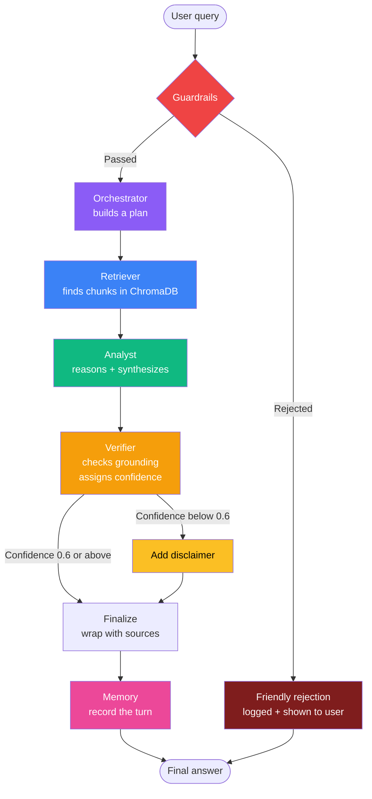

# Atlas

A local-first multi-agent system that answers complex business questions by reasoning across your enterprise documents.

Atlas is not a chatbot. It is a pipeline of five specialized agents, wired together with LangGraph, that plans, retrieves, reasons, verifies, and remembers. Every step is logged. Every claim is traceable back to a source document. The vector store, the documents, the logs, and the UI all run on your machine. Only the LLM and embedding calls leave.


## What it does

Upload your PDFs, DOCX files, or text documents. Ask a question. The orchestrator produces a plan. The retriever pulls the right chunks from the vector store, biased toward whichever document you asked about. The analyst reasons across those chunks. The verifier independently checks that every claim is grounded in the source. If confidence is low, the answer gets a visible disclaimer. The full reasoning chain is one click away in the UI.



## The five agents

| Agent | What it does |
|---|---|
| **Orchestrator** | Reads the query, decides which agents to call and in what order, produces a numbered plan |
| **Retriever** | Embeds the query, searches ChromaDB, returns the most relevant chunks with source attribution and relevance scores |
| **Analyst** | Reasons across the retrieved chunks, synthesizes a grounded answer, refuses to hallucinate when evidence is missing |
| **Verifier** | Independently checks that every claim in the answer is supported by source documents, assigns a confidence score |
| **Memory** | Holds the last few turns of conversation so follow-up questions work naturally |

The full state machine runs through LangGraph. Every node writes to a shared state object that is logged to JSON for later inspection.

## Tech stack

| Layer | Choice | Why |
|---|---|---|
| Language | Python 3.11+ | Modern type hints, good async story, broad library support |
| Agent framework | LangGraph | Explicit state machine, conditional edges, full traceability |
| LLM | Google Gemini `gemini-3.1-flash-lite` | Free tier, fast, good enough for grounded reasoning |
| Embeddings | Ollama `nomic-embed-text` (default) | Local, no rate limit, no API key. Gemini available as fallback |
| Vector database | ChromaDB 1.5 | Persistent on disk, metadata filtering, no separate server |
| Document parsing | LangChain PDF, text, and DOCX loaders | Battle tested, easy to extend |
| Chunking | Recursive character splitter, 500 chars, 50 overlap | Good balance between context size and recall |
| Guardrails | Custom input validation + output disclaimer | Length, prompt injection, empty corpus, low confidence |
| Evaluation | Structured JSON logs, one file per query | Readable from the UI, easy to diff, no external DB |
| UI | Streamlit, dark theme | Fast to iterate, no JS build step |
| Package manager | `uv` | Lockfile committed, fast installs, no `requirements.txt` drift |

## Quick start

You need Python 3.11 or newer, the `uv` package manager, and a Google Gemini API key from [aistudio.google.com](https://aistudio.google.com/apikey). For local embeddings you also need [Ollama](https://ollama.com/) and the `nomic-embed-text` model pulled.

Clone the repo and install dependencies. The lockfile is committed, so you get the exact tested versions.

```bash
git clone <your-repo-url>
cd Atlas
uv sync
```

Copy the environment template and add your real Gemini API key. Your `.env` is already in `.gitignore` and will never be committed.

```bash
cp .env.example .env
```

```bash
GEMINI_API_KEY=your_real_key_here
GEMINI_MODEL=gemini-3.1-flash-lite
EMBEDDING_BACKEND=ollama
```

Start the app. The first launch wipes the local database to give you a clean slate.

```bash
unset VIRTUAL_ENV
uv run python -m streamlit run ui/app.py
```

Open the URL Streamlit prints (usually `http://localhost:8501`). Upload documents from the sidebar, click Index, then start asking questions.

> Always use `python -m streamlit` and not the bare `streamlit` command. The shim that `uv` places in `.venv/bin/` has a stale shebang and will fail to launch.

## Repository layout

```
agents/             The five official agents
lib/               Cross-cutting helpers
  query_rewriter.py   Optional LLM based query normalization
  document_classifier.py  Filename and content based doc type detection
  api_errors.py       Translates Gemini errors into friendly messages
graph/             LangGraph wiring and the run_query entry point
vector_store/      Document ingestion (PDF, DOCX, TXT, MD)
guardrails/        Input and output safety checks
evaluation/        Observability, one JSON log per query
ui/                Streamlit frontend, dark theme
tests/             148 deterministic tests, no LLM calls
chroma_db/         Local ChromaDB store (gitignored)
logs/              Evaluation log output (gitignored)
```

## Documentation

The full design notes live in three short documents in the repo root.

| File | What is in it |
|---|---|
| `ARCHITECTURE.md` | ASCII flow diagram, AgentState schema, the five agent role breakdowns, LangGraph design trade offs, failure handling matrix |
| `EVALUATION.md` | Guardrails in detail, RAG Triad grounding scoring, the 0.6 confidence threshold rationale, every known failure mode |
| `UNIT_TESTS.md` | Per test breakdown, design principles, run commands, expected outcomes, deliberate scope boundaries |

## Testing

The full suite runs in under a second. No LLM calls, no network, no flake.

```bash
unset VIRTUAL_ENV
uv run python -m pytest tests/
```

## Resetting the knowledge base

The Reset Knowledge Base button sits at the top of the sidebar. Click it to wipe every embedded chunk, clear the conversation history, and reset the memory in one step. The knowledge base also resets automatically on every fresh Streamlit session, so a browser refresh gives you a clean slate without touching the button.

## License

Internal use.
